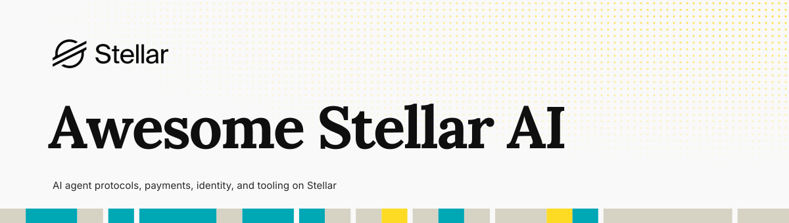

# Awesome Stellar AI  

> AI agent protocols, infrastructure, developer tools, and applications built on Stellar.

[Stellar](https://stellar.org) is an open payments network with seconds-to-finality settlement, sub-cent transaction fees, native stablecoins such as USDC, and smart contracts through Soroban. Agent payment protocols including x402 and MPP ship native Stellar support.

This community-curated list covers projects where Stellar is a meaningful part of the agent architecture: identity, payments, authorization, coordination, settlement, or verifiable on-chain activity. Stellar is not an EVM chain, so EVM-origin standards belong here only when they have a concrete Stellar or Soroban implementation. Projects are grouped by their primary function, not by where they first appeared.

Awesome Stellar AI is independent and is not an official Stellar Development Foundation directory. It is maintained by Trion Labs, which also builds Stellar 8004; that entry is marked below and was reviewed against the same evidence standard as every other. Inclusion decisions follow the [governance policy](GOVERNANCE.md), and every entry has a review record in the [evidence catalog](catalog/evidence.json).

**Evidence signals:** 🟢 confirmed against an independent source, such as a block explorer or a package registry · 🟡 confirmed only by the project itself, or by an independent source that shows presence rather than use. Entries without a signal make no deployment or release claim.

## Contents

- [Core Protocols and Standards](#core-protocols-and-standards)
- [Identity, Reputation, and Discovery](#identity-reputation-and-discovery)
- [Agent Payments and Monetization](#agent-payments-and-monetization)
- [Wallets, Authorization, and Policy](#wallets-authorization-and-policy)
- [MCP Servers and Agent Tooling](#mcp-servers-and-agent-tooling)
- [Marketplaces and Coordination](#marketplaces-and-coordination)
- [Agents and Applications](#agents-and-applications)
- [Developer Resources](#developer-resources)
- [Hackathons](#hackathons)

## Core Protocols and Standards

- [@stellar/mpp](https://github.com/stellar/stellar-mpp-sdk) - Official SDK implementing the Stellar payment method for MPP charge payments and off-chain payment channels with on-chain settlement.
- [Stellar 8004](https://github.com/trionlabs/stellar-8004) - 🟢 Mainnet Soroban implementation of ERC-8004 identity, reputation, and validation registries, with a TypeScript SDK, an indexer, and an explorer; maintained by this list's maintainer ([registry contract](https://stellar.expert/explorer/public/contract/CBGPDCJIHQ32G42BE7F2CIT3YW6XRN5ED6GQJHCRZSNAYH6TGMCL6X35)).
- [x402](https://github.com/x402-foundation/x402) - Open HTTP payment protocol with native Stellar support through the `@x402/stellar` package.

## Identity, Reputation, and Discovery

- [stellar-agent-search](https://github.com/berkingurcan/stellar-agent-search) - 🟢 Read-only MCP server and CLI for discovering, ranking, and vetting agents registered with Stellar 8004; the local package is published to npm and the official MCP Registry, while its hosted transport is pending ([npm](https://registry.npmjs.org/stellar-agent-search/latest), [registry](https://registry.modelcontextprotocol.io/v0.1/servers/io.github.berkingurcan%2Fstellar-agent-search/versions/0.1.0)).

## Agent Payments and Monetization

- [MPP Router](https://github.com/mpprouter/rozo-mpprouter) - 🟢 Open-source router for reaching paid MPP services from Stellar-funded clients through a stable API on mainnet ([live service](https://apiserver.mpprouter.dev/health), [proof](https://stellar.expert/explorer/public/account/GDK3AVW3YE6UL3J4WLNKBMP65KSY32YPUKIOC6PXW65XJ3LEG3YIDXXB)).
- [RouteDock](https://github.com/winsznx/routedock) - 🟢 Unified client for x402, MPP charge, and MPP session payments on Stellar testnet ([proof](https://stellar.expert/explorer/testnet/tx/5f603387807faacdc02c71efb74b26091b1be67740f74dfd581d23d643e2db64)).
- [ROZO Checkout](https://github.com/RozoAI/rozo-checkout-skill) - Agent skill and npm CLI that settles a Coinbase Payment Link invoice with Stellar USDC, routing the deposit and its required text memo so services that only accept USDC on Base can be funded from Stellar ([package](https://registry.npmjs.org/@rozoai/checkout/0.1.6)).
- [TollPay](https://github.com/rajkaria/toll) - 🟢 Middleware and SDKs for monetizing MCP tools with per-call USDC payments on Stellar mainnet ([proof](https://stellar.expert/explorer/public/tx/015ef6bacf0520d567fa3cac44a7135ff4152fda79ee72d2e49a1f8670081099)).
- [x402 MCP Stellar Template](https://github.com/ffarinas/x402-mcp-stellar-template) - 🟢 Node.js, Python, and Go templates for paid MCP servers, wallet provisioning, and spending limits on Stellar mainnet ([proof](https://stellar.expert/explorer/public/tx/af4d17dd8a5c33004365ae4d5c66c82d25cadbabe6af5a63c2450c0fd64fe58a)).

## Wallets, Authorization, and Policy

- [Prism](https://github.com/Bekirerdem/prism) - 🟢 Testnet smart treasury for AI agents with spending caps, session keys, allowlists, escrow, and optional Stellar 8004 reputation checks ([proof](https://stellar.expert/explorer/testnet/contract/CAYWNXHANRY5GSJAZOR4YTKBKNOKTCITE52ZRKDKCAWLDTYWFFVFSPAZ)).
- [Stellar Agent Wallet Skill](https://github.com/mpprouter/stellar-agent-wallet-skill) - Agent skill for Stellar USDC balances, transfers, swaps, trustlines, and payments to x402 or MPP-gated services.

## MCP Servers and Agent Tooling

- [Pulsar](https://github.com/benelabs/pulsar) - MCP server for Stellar and Soroban development, including account queries, transaction simulation, contract deployment, and transaction submission.
- [Stellar Raven](https://github.com/kalepail/stellar-raven) - 🟡 Hosted MCP gateway that combines official Stellar documentation, live ecosystem data, community intelligence, and tested development playbooks ([live service](https://raven.stellar.buzz)).

## Marketplaces and Coordination

- [AI-Net](https://github.com/Epta-Node/ai-net) - Experimental coordination network where specialized agents discover one another, delegate work, and settle payments on Stellar.
- [CleverCon](https://github.com/clevercon-protocol/clevercon) - 🟢 Testnet service marketplace and orchestrator that decomposes tasks, hires specialist agents, and pays them through x402 or MPP ([proof](https://stellar.expert/explorer/testnet/contract/CDFLEJ2HFPK3WKFTWB4CKP2JHEYNAUWKXGEJRYW4YMMGDSQSQ7D4LRTE)).
- [Talos](https://github.com/enliven17/talos-stellar) - Framework for autonomous agent corporations that register services and earn USDC through x402 payments on Stellar.

## Agents and Applications

- [ASGCard](https://github.com/ASGCompute/asgcard-public) - Virtual Mastercard integration for AI agents funded with USDC through x402 on Stellar.
- [Cards402](https://github.com/CTX-com/Cards402) - SDK, CLI, and MCP server for issuing virtual Visa cards to agents after payment in USDC or XLM.
- [Nulucre Agents](https://github.com/vjshaw/nulucre-agents) - 🟡 Wallet reputation and DeFi fact-verification agents that accept x402 micropayments on Stellar and Base ([proof](https://stellar.expert/explorer/public/account/GCRUBFDANV52JP3URUJ7EZGPZKFEESBTW7T3FV2SJXZZGB6HDNRBWV24)).
- [RenderGate](https://github.com/tantk/rendergate) - 🟢 Pay-per-render browser service for agents, with a live endpoint and testnet x402 payments ([proof](https://stellar.expert/explorer/testnet/tx/5c898eb489265c142baee086d502e25b87a5536e4386e5ccdf69edc2515c0ef6)).

## Developer Resources

- [Building with AI](https://developers.stellar.org/docs/build/building-with-ai) - Official guide to Stellar-focused AI assistants, MCP servers, skills, and documentation resources.
- [Lumen Loop](https://github.com/lumenloop/lumenloop-overview) - Open discovery and ecosystem intelligence layer for projects, builders, funding, and activity across Stellar.
- [Stellar Agentic Payments](https://developers.stellar.org/docs/build/agentic-payments) - Official documentation for building agent payment flows with x402 and MPP.
- [Stellar Dev Skill](https://github.com/stellar/stellar-dev-skill) - AI skill covering Stellar smart contracts, applications, assets, data, agentic payments, standards, and zero-knowledge development.
- [Stellar Light](https://github.com/Stellar-Light/stellarlight) - Ecosystem data layer for Stellar exposing project intelligence, GitHub activity, and funding data through a web app, a REST API, an MCP server, and an agent skill.

## Hackathons

- [Stellar Agents Hackathon Retrospective](https://developers.stellar.org/meetings/2026/04/23) - Stellar Development Foundation overview of notable submissions and the technical patterns that emerged from the event.
- [Stellar Hacks: Agents](https://dorahacks.io/hackathon/stellar-agents-x402-stripe-mpp/detail) - 2026 hackathon focused on agents and micropayments using x402 and MPP; its five winners were Cards402, CleverCon, RenderGate, x402 MCP Stellar Template, and TollPay.

## Contributing

Contributions are welcome. Read the [contribution guidelines](CONTRIBUTING.md) before opening a pull request. This is a curated list, so inclusion is based on technical relevance, public evidence, and usefulness rather than submission alone.
